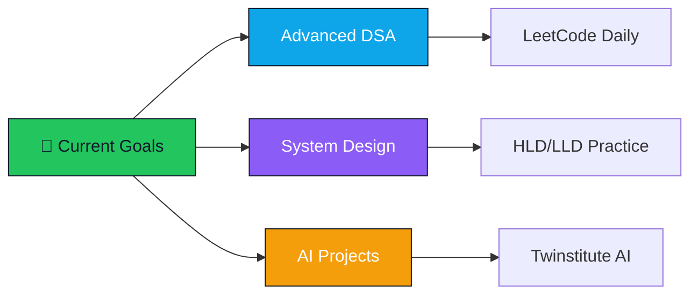

<!-- ========================================================================
   MOHAMMED QIZAR BILAL | AI SYSTEMS ENGINEER
   Premium • World-Class • Interactive • Award-Worthy Profile
======================================================================== -->

<div align="center">

<!-- ANIMATED HEADER WAVE -->


<!-- DYNAMIC TYPING ANIMATION -->


<br/>

<!-- PROFILE VISITOR COUNTER -->


<!-- SOCIAL BADGES WITH HOVER EFFECTS -->
<p>
  <a href="mailto:bilalqizar@gmail.com">
    
  </a>
  <a href="https://www.linkedin.com/in/mohammed-qizar-bilal">
    
  </a>
  <a href="https://qizar-bilal.vercel.app">
    
  </a>
  <a href="https://github.com/QizarBilal">
    
  </a>
</p>

<!-- LOCATION & STATUS -->


</div>

---

<!-- ANIMATED DIVIDER -->


<!-- ABOUT ME SECTION WITH GIF -->
<div align="center">

##  About Me

</div>

<div align="center">
<table>
<tr>
<td width="50%">

```typescript
const mohammed = {
  role: "Software Engineer (SDE) | Full-Stack Developer | AI Engineer",
  focus: [
    "Scalable Backend Systems",
    "Full-Stack Applications",
    "AI-Powered Products"
  ],
  approach: {
    problem: "Real-world challenges",
    architecture: "Scalable & clean systems",
    execution: "Production-ready engineering",
    impact: "Measurable results"
  },
  currentProjects: [
    "Twinstitute AI (Multi-Agent System)",
    "Advanced DSA & System Design",
    "Full-Stack + AI Products"
  ],
  philosophy: "Build systems that scale, not just features"
};
```

</td>
<td width="50%">

</td>
</tr>
</table>
</div>

---

<!-- ANIMATED DIVIDER -->


<!-- TECH STACK SECTION WITH CAROUSEL EFFECT -->
<div align="center">

##  Tech Arsenal

</div>

<!-- ANIMATED SKILLS SHOWCASE -->
<div align="center">

### 💻 Languages & Frameworks


### 🗄️ Databases & Tools


### ⚙️ DevOps & Infrastructure


### 🤖 AI/ML & Data Science


</div>

</br>
<!-- ADDITIONAL TECH STACK TABLE -->
<div align="center">
<table>
<tr>
<td align="center" width="25%">

<br><strong>Python</strong>
</td>
<td align="center" width="25%">

<br><strong>TypeScript</strong>
</td>
<td align="center" width="25%">

<br><strong>React</strong>
</td>
<td align="center" width="25%">

<br><strong>Docker</strong>
</td>
</tr>
<tr>
<td align="center" width="25%">

<br><strong>REST API</strong>
</td>
<td align="center" width="25%">

<br><strong>AWS</strong>
</td>
<td align="center" width="25%">

<br><strong>GitHub</strong>
</td>
<td align="center" width="25%">

<br><strong>Nginx</strong>
</td>
</tr>
</table>
</div>

---

<!-- ANIMATED DIVIDER -->


<!-- RECRUITER QUICK VIEW -->
<div align="center">

##  Recruiter Quick View

</div>

<div align="center">

| 🎯 **Core Strength** | 🚀 **Flagship Project** | 💡 **Impact** |
|:---:|:---:|:---:|
| **AI Systems Architecture** | Twinstitute AI | Multi-agent career development platform |
| **NLP & Machine Learning** | SkillMatch-AI | 85%+ accuracy resume intelligence |
| **Full-Stack Development** | Zidio Portal | Complete hackathon management ecosystem |
| **Applied AI Solutions** | MediVerse Guardian X | AI-powered prescription verification |

</div>

<div align="center">

### 🎖️ What Sets Me Apart

<table>
<tr>
<td align="center" width="33%">

<br><strong>Clean Architecture</strong>
<br><sub>Modular, scalable, maintainable</sub>
</td>
<td align="center" width="33%">

<br><strong>Production Focus</strong>
<br><sub>Real-world deployment ready</sub>
</td>
<td align="center" width="33%">

<br><strong>Problem Solver</strong>
<br><sub>Complex challenges, elegant solutions</sub>
</td>
</tr>
</table>

</div>

---

<!-- ANIMATED DIVIDER -->


<!-- FEATURED PROJECTS -->
<div align="center">

##  Featured Projects

</div>

<!-- PROJECT 1: TWINSTITUTE AI -->
<div align="center">

### 🏗️ Twinstitute AI


**AI-Powered Digital Institution Twin | Multi-Agent Career Development Platform**

[](https://github.com/QizarBilal/Twinstitute-AI)


</div>

<div align="center">
<table>
<tr>
<td width="50%">

**🎯 System Architecture**
```
User Request
    ↓
API Gateway
    ↓
Agent Orchestrator
    ↓
┌─────────┬─────────┬─────────┐
│ Career  │  Skill  │ Content │
│ Advisor │ Analyst │  Agent  │
└─────────┴─────────┴─────────┘
    ↓
Response Pipeline
    ↓
Structured Output
```

</td>
<td width="50%">

**📊 Key Metrics**

| Feature | Details |
|---------|---------|
| 🤖 Agents | 5+ Specialized |
| 🧩 Modules | 8+ Integrated |
| ⚡ Response | Real-time |
| 🎯 Accuracy | High-fidelity |
| 🔄 Scalability | Production-ready |

</td>
</tr>
</table>
</div>

<div align="center">

**Tech Stack:** Python • FastAPI • LangChain • OpenAI • ChromaDB • Redis

</div>

---

<!-- PROJECT 2: SKILLMATCH AI -->
<div align="center">

### 🧠 SkillMatch-AI
  
  
  
**Resume Intelligence System | NLP-Powered Job Matching**

[](https://github.com/QizarBilal/SkillMatch-AI)
[](http://qizarbilal-skillmatch-ai.hf.space/)

</div>

<div align="center">
<table>
<tr>
<td width="60%">

**🔍 System Capabilities**

- ✅ **Advanced NLP Parsing**: Extract skills, experience, education
- ✅ **Intelligent Matching**: 85%+ accuracy job-role alignment
- ✅ **Real-time Processing**: <2s response time
- ✅ **Multi-format Support**: PDF, DOCX, TXT
- ✅ **Skill Gap Analysis**: Automated recommendations
- ✅ **RESTful API**: Production-ready endpoints

</td>
<td width="40%">

**📈 Performance**

```python
{
  "parsing_accuracy": "92%",
  "match_precision": "85%+",
  "response_time": "<2s",
  "supported_formats": 3,
  "api_uptime": "99.5%"
}
```

</td>
</tr>
</table>
</div>

<div align="center">

**Tech Stack:** Python • Flask • spaCy • NLTK • scikit-learn • HuggingFace

</div>

---

<!-- PROJECT 3: ZIDIO PORTAL -->
<div align="center">

### 🎯 Zidio Hackathon Portal
  
  
  
**Enterprise Hackathon Management Platform | Full-Stack Solution**

[](https://github.com/QizarBilal/Zidio-Hackathon-Portal)
[](https://zidio-hackathon.netlify.app/)

</div>

<div align="center">

| 🎨 Frontend | ⚙️ Backend | 🗄️ Database | 🚀 Deployment |
|:---:|:---:|:---:|:---:|
| React.js | Node.js | MongoDB | Netlify |
| TailwindCSS | Express.js | Redis | AWS |
| Redux | JWT Auth | PostgreSQL | Docker |

**Features:** Team Management • Real-time Leaderboards • Submission Portal • Admin Dashboard • Analytics

</div>

---

<!-- PROJECT 4 & 5 -->
<div align="center">

### 🏥 MediVerse Guardian X | 🌱 GreenNode

<table>
<tr>
<td width="50%">

**MediVerse Guardian X**


AI-powered prescription verification system

[](https://github.com/QizarBilal/MediVerse-GuardianX)

🔍 OCR • 🤖 AI Validation • ⚕️ Medical NLP

</td>
<td width="50%">

**GreenNode**


Sustainability tracking platform

[](https://github.com/QizarBilal/GreenNode)

🌍 Carbon Tracking • 📊 Analytics • 🌿 Impact Metrics

</td>
</tr>
</table>

</div>

---

<!-- ANIMATED DIVIDER -->


<!-- GITHUB STATS -->
<div align="center">

##  GitHub Analytics

</div>

<div align="center">
<table>
<tr>
<td width="50%">

</td>
<td width="50%">

</td>
</tr>
</table>
</div>

<!-- CONTRIBUTION GRAPH -->
<div align="center">

</div>

<!-- ACTIVITY GRAPH -->
<div align="center">

</div>

<!-- TROPHIES -->
<div align="center">

</div>

---

<!-- ANIMATED DIVIDER -->


<!-- EXPERIENCE SECTION -->
<div align="center">

##  Professional Journey

</div>

<div align="center">
<table>
<tr>
<td width="33%">

###  Webill India

**Lead Product Engineer**  
*March 2026 – Present*

```yaml
achievements:
  - Scalable internal systems
  - REST API architecture
  - System reliability ↑
  - Backend optimization
```

</td>
<td width="33%">

###  Infosys

**AI Intern**  
*Springboard Program*

```yaml
achievements:
  - Built SkillMatch-AI
  - NLP pipeline design
  - ML workflow automation
  - Production deployment
```

</td>
<td width="33%">

###  Zidio Dev

**Frontend Developer**  
*Development Team*

```yaml
achievements:
  - React components
  - Performance tuning
  - State management
  - UI/UX optimization
```

</td>
</tr>
</table>
</div>

---

<!-- ANIMATED DIVIDER -->


<!-- ENGINEERING PHILOSOPHY -->
<div align="center">

## 🧠 Engineering Philosophy

</div>

<div align="center">
<table>
<tr>

<td align="center" width="25%">

<br><br>
<strong>Modular Design</strong>
<br><sub>Separation of concerns • Reusable components</sub>
</td>

<td align="center" width="25%">

<br><br>
<strong>Scalable Architecture</strong>
<br><sub>Designed for growth • Distributed systems</sub>
</td>

<td align="center" width="25%">

<br><br>
<strong>Performance First</strong>
<br><sub>Low latency • Efficient resource usage</sub>
</td>

<td align="center" width="25%">

<br><br>
<strong>Production Ready</strong>
<br><sub>Reliable • Tested • Deployment-focused</sub>
</td>

</tr>
</table>
</div>

---

<!-- ANIMATED DIVIDER -->


<!-- CURRENT FOCUS -->
<div align="center">

##  Current Focus

</div>

<div align="center">



</div>

<div align="center">
<table>
<tr>
<td align="center" width="33%">

<br><strong>🧠 DSA Mastery</strong>
<br><sub>Daily practice & problem solving</sub>
</td>
<td align="center" width="33%">

<br><strong>🏗️ System Design</strong>
<br><sub>HLD & LLD fundamentals</sub>
</td>
<td align="center" width="33%">

<br><strong>🚀 AI Innovation</strong>
<br><sub>Building production systems</sub>
</td>
</tr>
</table>
</div>

---

<!-- ANIMATED DIVIDER -->


<!-- CONNECT SECTION -->
<div align="center">

##  Let's Connect


### Open to Software Engineering Opportunities

<p>
<a href="mailto:bilalqizar@gmail.com">

</a>
<a href="https://www.linkedin.com/in/mohammed-qizar-bilal">

</a>
<a href="https://qizar-bilal.vercel.app">

</a>
</p>

### 📝 For Recruiters

```diff
+ Review flagship projects (Twinstitute AI, SkillMatch-AI)
+ Assess system design and architecture depth
+ Evaluate production-ready code quality
+ Consider real-world problem-solving approach

! I build systems that solve real problems, not just demonstrate features
```

</div>

---

<!-- ANIMATED FOOTER -->
<div align="center">

### ⭐ Star this profile if you found it impressive!


</div>

<!-- FINAL QUOTE -->
<div align="center">

> *"Building scalable systems that solve real-world problems"*

<sub>Made with ❤️ and lots of ☕</sub>

</div>
