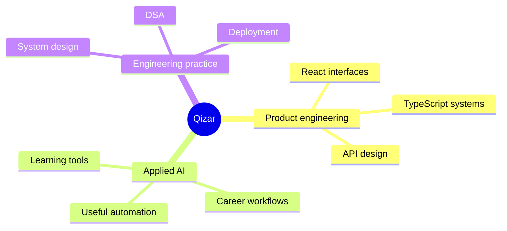

<div align="center">

# Mohammed Qizar Bilal

### Software engineer building practical full-stack and AI products

[Portfolio](https://qizar-bilal.vercel.app) · [LinkedIn](https://www.linkedin.com/in/mohammed-qizar-bilal) · [Email](mailto:bilalqizar@gmail.com)

</div>


## Hello — I’m Qizar.

I enjoy the seam between product thinking and engineering: taking a useful idea, shaping the system behind it, and carrying it through to an interface people can actually use. My recent work spans TypeScript applications, backend services, AI-assisted workflows, and developer-facing tools.

Right now I’m sharpening system design, data structures, and the decisions that make software easier to operate after the demo is over.

<br clear="right" />

## A small map of my work


```mermaid
mindmap
  root((Qizar))
    Product engineering
      React interfaces
      TypeScript systems
      API design
    Applied AI
      Learning tools
      Career workflows
      Useful automation
    Engineering practice
      System design
      DSA
      Deployment
```

## Projects I would start with

| Project | Why it exists | Engineering surface |
|---|---|---|
| [Twinstitute AI](https://github.com/QizarBilal/Twinstitute-AI) | Explores adaptive, AI-supported learning experiences. | Next.js, TypeScript, Prisma, generative AI |
| [SkillMatch AI](https://github.com/QizarBilal/SkillMatch-AI) | Connects candidate skills with role requirements. | AI-assisted matching, full-stack product flow |
| [Finance Intelli](https://github.com/QizarBilal/Finance-Intelli) | Makes personal finance information easier to understand and act on. | Authentication, dashboards, deployed web app |
| [Mail Pilot](https://github.com/QizarBilal/mail-pilot) | Treats email work as an organized automation workflow. | Product UX, mail operations, AI assistance |

## How I like to build

```text
understand the user → model the data → define boundaries → ship a thin slice
        ↑                                                     ↓
        └──────────── observe, simplify, and iterate ─────────┘
```

- Start with the real user journey, not a checklist of technologies.
- Keep interfaces and service boundaries explicit.
- Use AI where it reduces friction or improves a decision—not as decoration.
- Document assumptions, especially around security, data, and deployment.
- Prefer a working, inspectable slice over a very large promise.

## Tools on my desk

**Languages** — TypeScript, JavaScript, Python, Java, SQL  
**Web** — React, Next.js, Node.js, Express, Tailwind CSS  
**Data** — PostgreSQL, MongoDB, Prisma  
**AI work** — LLM-backed product flows, retrieval patterns, prompt and output design  
**Delivery** — Git, GitHub, Vercel, API testing, responsive UI

## Currently learning in public

- Data structures and algorithms through steady problem-solving
- High-level and low-level system design
- Reliable patterns for shipping AI-enabled applications
- Better ways to explain architecture through code, diagrams, and documentation

## A note for collaborators

If you are opening an issue or proposing a collaboration, lead with the problem, who experiences it, and what a useful first release would look like. That context makes technical conversations much more productive.

## Let’s talk

I’m open to software engineering opportunities and thoughtful product collaborations. The quickest routes are [LinkedIn](https://www.linkedin.com/in/mohammed-qizar-bilal) or [email](mailto:bilalqizar@gmail.com).

<sub>This profile README is intentionally maintained as a living engineering note—not a generated résumé. Personal photographs and biographical content remain the author’s own.</sub>
